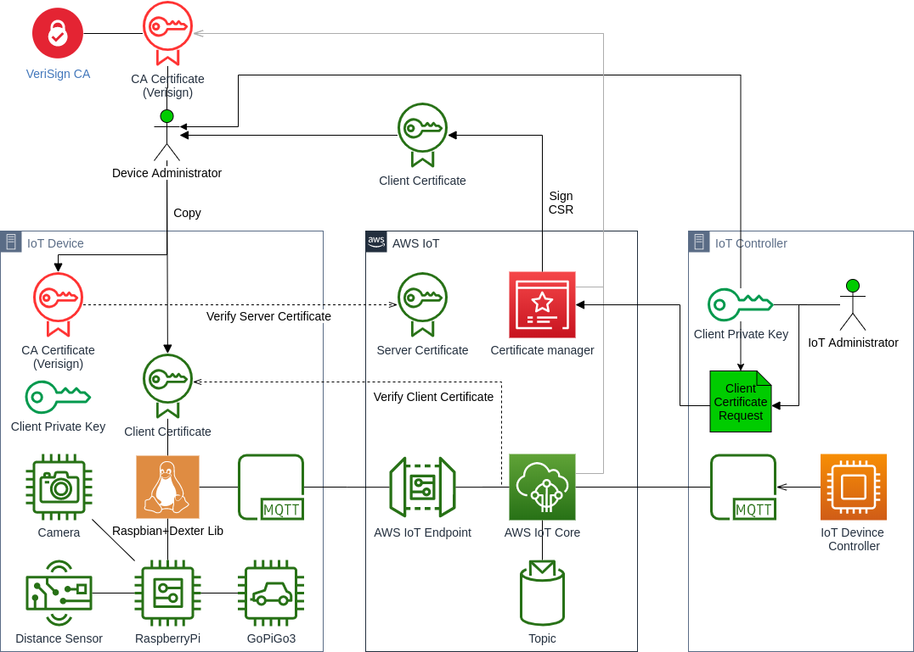
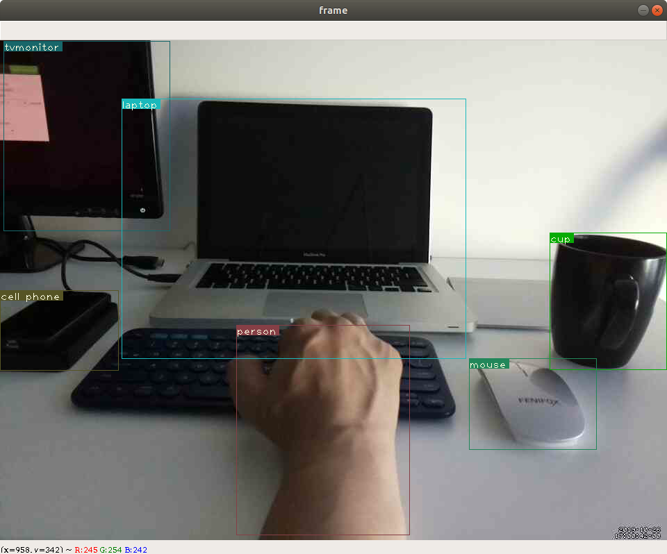
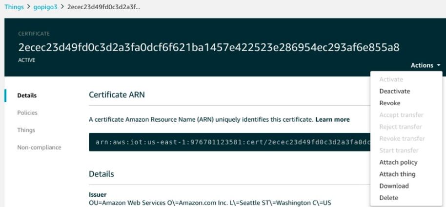

# AWS IoT Configuration

## IoT PKI setup

* [AWS IoT Developer Guide - Configure Your Device](https://docs.aws.amazon.com/iot/latest/developerguide/configure-iot.html)
> All devices must have a device certificate, private key, and root CA certificate installed in order to communicate with AWS IoT. Consult your device's documentation to connect to it and copy your device certificate, private key, and root CA certificate onto your device.

The IoT administrator needs to generate a CSR (Certificate Signing Request) and let the AWS IoT certificate manager sign the CSR to generate a client certificate.

#### Generate CSR
```dtd
#--------------------------------------------------------------------------------
# "iot.csr" needs to be renamed to the device ID
#--------------------------------------------------------------------------------
openssl req -new -newkey rsa:2048 -nodes -keyout iot.key -out iot.csr
```
#### Sign CSR by AWS IoT

**AWS CLI**

* [create-certificate-from-csr](https://docs.aws.amazon.com/cli/latest/reference/iot/create-certificate-from-csr.html)
```dtd
aws iot create-certificate-from-csr \
    --certificate-signing-request=file://iot.csr
```

**Teerraform**
```dtd
#--------------------------------------------------------------------------------
# Sign CSR
# [Overview]
# To verify the device that accesses AWS IoT is legitimate, a client certificate
# signed by AWS IoT is required.
#
# [Prerequisite]
# CSR file "iot.csr" in scripts/terraform/aws/iot/pki directory.
#
# [How do I create self-signed device certificates to authenticate my devices with AWS IoT?]
# https://aws.amazon.com/premiumsupport/knowledge-center/iot-self-signed-certificates/
#--------------------------------------------------------------------------------
resource "aws_iot_certificate" "this" {
  csr    = "${file("${local.module_path}/pki/iot.csr")}"
  active = true
}

```

#### Download the client certificate

From the IoT Console, Manage > Things > Security and select Download from Actions.



## AWS IoT Thing setup

#### Register a Thing
Register your device in the Amazon Console. Go to IoT menu > Manage > Things.

#### Create a policy and attach to the AWS IoT Thing
Create a policy in AWS IoT Console Menu > Secure > Policies. Attach the policy in AWS Iot Console Menu  > Manage > Things and select the Thing.


## AWS IoT Endpoint setup

Each account has a specific IoT endpoint with which the IoT device(s) interact with.

**AWS CLI**
```dtd
$ aws iot describe-endpoint --region us-east-1
{
    "endpointAddress": "aix88q3urwa6k.iot.us-east-1.amazonaws.com"
}
```

Test the connectivity to the endpoint both from the controller side and from within the device.
```dtd
#--------------------------------------------------------------------------------
# Replace "e48b59a7a9-certificate" with your client certificate name.
#--------------------------------------------------------------------------------
$ openssl s_client -connect $ENDPOINT:8443 -CAfile ./ca.pem -cert e48b59a7a9-certificate.pem -key e48b59a7a9-private.pem.key
```

Refer to the appendex A1 for the output example.

## Device setup

The device administrator needs to setup the PKI with the files in the device.

* CA certificate issued by Verisign that is to be trusted
* Client certificate signed by AWS IoT
* Client certificate private key

#### CA certificate

Download the CA certificate from Verisign and copy to the trust store (depends on the OS) in the device.
    
*  [How do I create self-signed device certificates to authenticate my devices with AWS IoT? ](https://aws.amazon.com/premiumsupport/knowledge-center/iot-self-signed-certificates/)
> Your device authenticates connections to AWS IoT with the Verisign root CA server certificate. Download the Verisign root CA server certificate from Symantec by running this command from the console:
  Only the Verisign root CA server certificate can be used to authenticate the AWS IoT server. You cannot use your own CA certificate to authenticate the AWS IoT server.  

```
curl https://www.symantec.com/content/en/us/enterprise/verisign/roots/VeriSign-Class%203-Public-Primary-Certification-Authority-G5.pem > iotRootCA.pem
```

#### Client certificate and client private key
Copy the signed client certificate and the client private key to the client cert store (depends on OS) in the device.

---

# MQTT

## MQTT Client
Install the MQTT client runtime.

* [PAHO API documentation (Python)](https://pypi.org/project/paho-mqtt/#usage-and-api)
* [MQTT Fx](https://mqttfx.jensd.de/)

---

# Automated setup
## AWS IoT setup
Terraform scripts to setup AWS IoT are located in the directory.
```dtd
scripts/terraform
```

Run the commands to execute and take the note of the output.
```dtd
cd scripts/terraform/aws/iot
terraform init
terraform plan
terraform apply
```

The output looks like below.
```dtd
aws_iot_certificate_arn = arn:aws:iot:us-east-1:976701123581:cert/2ecec23d49fd0c3d2a3fa0dcf6f621ba1457e422523e286954ec293af6e855a8
aws_iot_endpoint_address = aix88q3urwa6k.iot.us-east-1.amazonaws.com
aws_iot_policy = {
  "Version": "2012-10-17",
  "Statement": [
    {
      "Sid": "TestDevAllowGopigo3AccessIoT",
      "Effect": "Allow",
      "Action": "iot:*",
      "Resource": "*"
    }
  ]
}
aws_iot_policy_name = {
  "Version": "2012-10-17",
  "Statement": [
    {
      "Sid": "TestDevAllowGopigo3AccessIoT",
      "Effect": "Allow",
      "Action": "iot:*",
      "Resource": "*"
    }
  ]
}
aws_iot_thing_id = gopigo3
aws_iot_thing_name = gopigo3
```


## Device setup
Ansible playbooks to setup Linux in the IoT device are located in the directory.
```
scripts/ansible
```

First, setup an Ansible user account in the device Linux and give a sudo permission to be able to run command without password prompt. Genereate a SSH key and copy the public key to the .ssh/authorized_key file in the Ansible account home directory.

Run the command to execute.
```
scripts/ansible/03_packages/scripts/main.sh
```


---
# Appendix

## A1. Endpoint test output
```dtd
pi@dex:~/.ssh $ openssl s_client -connect $ENDPOINT:8443 -CAfile ./ca.pem -cert e48b59a7a9-certificate.pem -key e48b59a7a9-private.pem.key
CONNECTED(00000003)
depth=2 C = US, O = "VeriSign, Inc.", OU = VeriSign Trust Network, OU = "(c) 2006 VeriSign, Inc. - For authorized use only", CN = VeriSign Class 3 Public Primary Certification Authority - G5
verify return:1
depth=1 C = US, O = Symantec Corporation, OU = Symantec Trust Network, CN = Symantec Class 3 ECC 256 bit SSL CA - G2
verify return:1
depth=0 C = US, ST = Washington, L = Seattle, O = "Amazon.com, Inc.", CN = *.iot.ap-southeast-2.amazonaws.com
verify return:1
---
Certificate chain
 0 s:/C=US/ST=Washington/L=Seattle/O=Amazon.com, Inc./CN=*.iot.ap-southeast-2.amazonaws.com
   i:/C=US/O=Symantec Corporation/OU=Symantec Trust Network/CN=Symantec Class 3 ECC 256 bit SSL CA - G2
 1 s:/C=US/O=Symantec Corporation/OU=Symantec Trust Network/CN=Symantec Class 3 ECC 256 bit SSL CA - G2
   i:/C=US/O=VeriSign, Inc./OU=VeriSign Trust Network/OU=(c) 2006 VeriSign, Inc. - For authorized use only/CN=VeriSign Class 3 Public Primary Certification Authority - G5
---
Server certificate
-----BEGIN CERTIFICATE-----
MIIEnDCCBEKgAwIBAgIQYV8YcsoMt3mwNlCzXqORTTAKBggqhkjOPQQDAjCBgDEL
MAkGA1UEBhMCVVMxHTAbBgNVBAoTFFN5bWFudGVjIENvcnBvcmF0aW9uMR8wHQYD
VQQLExZTeW1hbnRlYyBUcnVzdCBOZXR3b3JrMTEwLwYDVQQDEyhTeW1hbnRlYyBD
bGFzcyAzIEVDQyAyNTYgYml0IFNTTCBDQSAtIEcyMB4XDTE3MTEyMjAwMDAwMFoX
DTE4MTEyMzIzNTk1OVowfDELMAkGA1UEBhMCVVMxEzARBgNVBAgMCldhc2hpbmd0
b24xEDAOBgNVBAcMB1NlYXR0bGUxGTAXBgNVBAoMEEFtYXpvbi5jb20sIEluYy4x
KzApBgNVBAMMIiouaW90LmFwLXNvdXRoZWFzdC0yLmFtYXpvbmF3cy5jb20wWTAT
BgcqhkjOPQIBBggqhkjOPQMBBwNCAASOgPepVjyrxVEuW2tKTmjsW7F6gTLPEYY5
WEqIqKHc9eBHeOZ+s4q9ly2UqBGp2xEB4eUoAwte8tHeeECGVlWYo4ICnzCCApsw
TwYDVR0RBEgwRoIgaW90LmFwLXNvdXRoZWFzdC0yLmFtYXpvbmF3cy5jb22CIiou
aW90LmFwLXNvdXRoZWFzdC0yLmFtYXpvbmF3cy5jb20wCQYDVR0TBAIwADAOBgNV
HQ8BAf8EBAMCB4AwHQYDVR0lBBYwFAYIKwYBBQUHAwEGCCsGAQUFBwMCMGEGA1Ud
IARaMFgwVgYGZ4EMAQICMEwwIwYIKwYBBQUHAgEWF2h0dHBzOi8vZC5zeW1jYi5j
b20vY3BzMCUGCCsGAQUFBwICMBkMF2h0dHBzOi8vZC5zeW1jYi5jb20vcnBhMB8G
A1UdIwQYMBaAFCXwiuFLetkBlQrtxlPxjHgf2fP4MCsGA1UdHwQkMCIwIKAeoByG
Gmh0dHA6Ly9yYy5zeW1jYi5jb20vcmMuY3JsMFcGCCsGAQUFBwEBBEswSTAfBggr
BgEFBQcwAYYTaHR0cDovL3JjLnN5bWNkLmNvbTAmBggrBgEFBQcwAoYaaHR0cDov
L3JjLnN5bWNiLmNvbS9yYy5jcnQwggECBgorBgEEAdZ5AgQCBIHzBIHwAO4AdgDd
6x0reg1PpiCLga2BaHB+Lo6dAdVciI09EcTNtuy+zAAAAV/l8Om+AAAEAwBHMEUC
IQD3k6TK08IF2PXPqjM3lhCKkcge4hrtrd0nwlW1YU22+AIgD1UTY0DpZaeFlO5m
z4CUbarDZyphVYIRk1BgtqtcJekAdACkuQmQtBhYFIe7E6LMZ3AKPDWYBPkb37jj
d80OyA3cEAAAAV/l8OnrAAAEAwBFMEMCIBoId2H2/cCCymYciLZtDArvhd7CsL1i
yA3NSne82cK5Ah87MfLXCWNPqjE0P+F3zsPFtbJx/weROVT/PilK4QL8MAoGCCqG
SM49BAMCA0gAMEUCIQDu4hHGl8e/RDRmibxrHPVhJpshnvShZI7UqiWDBVK8oQIg
TnwwBu6ZmqtH47w4ORASQAjoApr4xvQdwRldOLJMgbM=
-----END CERTIFICATE-----
subject=/C=US/ST=Washington/L=Seattle/O=Amazon.com, Inc./CN=*.iot.ap-southeast-2.amazonaws.com
issuer=/C=US/O=Symantec Corporation/OU=Symantec Trust Network/CN=Symantec Class 3 ECC 256 bit SSL CA - G2
---
No client certificate CA names sent
Client Certificate Types: RSA sign, DSA sign, ECDSA sign
Requested Signature Algorithms: ECDSA+SHA512:RSA+SHA512:ECDSA+SHA384:RSA+SHA384:ECDSA+SHA256:RSA+SHA256:DSA+SHA256:ECDSA+SHA224:RSA+SHA224:DSA+SHA224:ECDSA+SHA1:RSA+SHA1:DSA+SHA1
Shared Requested Signature Algorithms: ECDSA+SHA512:RSA+SHA512:ECDSA+SHA384:RSA+SHA384:ECDSA+SHA256:RSA+SHA256:DSA+SHA256:ECDSA+SHA224:RSA+SHA224:DSA+SHA224:ECDSA+SHA1:RSA+SHA1:DSA+SHA1
Peer signing digest: SHA512
Server Temp Key: ECDH, P-256, 256 bits
---
SSL handshake has read 2662 bytes and written 1447 bytes
Verification: OK
---
New, TLSv1.2, Cipher is ECDHE-ECDSA-AES256-GCM-SHA384
Server public key is 256 bit
Secure Renegotiation IS supported
Compression: NONE
Expansion: NONE
No ALPN negotiated
SSL-Session:
    Protocol  : TLSv1.2
    Cipher    : ECDHE-ECDSA-AES256-GCM-SHA384
    Session-ID: 5B53E573E7D2DCDC5BC75A4BC41F8F025802C4240AE43AC19EE4688B427C5860
    Session-ID-ctx:
    Master-Key: 48A5213679E84D380B3422AC9C61DA46E9AF678FB951E9D9159B5D38806FD9F1E16D9CA1B5BAB822A6D830CDED9FBA76
    PSK identity: None
    PSK identity hint: None
    SRP username: None
    Start Time: 1532224883
    Timeout   : 7200 (sec)
    Verify return code: 0 (ok)
    Extended master secret: yes
---
```

